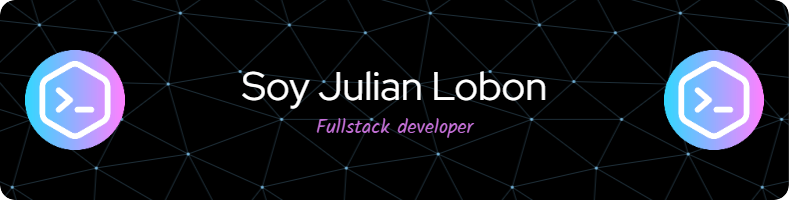

# ¡Hola,! 👋

¡Bienvenido/a a mi perfil de GitHub! Soy un apasionado del desarrollo de software y me encanta crear soluciones innovadoras. Aquí encontrarás algunos de mis proyectos destacados y podrás conocer un poco más sobre mí.

## 🔍 Sobre Mí

Soy un entusiasta del código abierto y un desarrollador de software con conocimiento en:

☕

 Mi objetivo es crear aplicaciones que resuelvan problemas del mundo real y brinden una excelente experiencia de usuario.

## 🚀 Proyectos Destacados

Aquí hay algunos proyectos que he estado trabajando recientemente:

- 🌟 [Manejo de DOM](https://github.com/Lobonjulian/Manipulacion-del-Dom) - creacion de aplicaciones mediantes el DOM.
- 🌟 [Java](https://github.com/Lobonjulian/Conversor) - Muestro algunas destraza en java...
- 🌟 [Python]() - En Breve ...

No dudes en explorar el resto de mis repositorios para ver más proyectos interesantes.

## 📬 Contacto

¡Me encantaría conectar contigo! Puedes encontrarme en:

- ✉️ Correo: julianlobon@hotmail.com
- ✉️ Correo: julitolos6@gmail.com
- 💼 LinkedIn: [Julian lobon](https://www.linkedin.com/in/julian-aguilar-/)

- 

- 

#### Puedes apoyar mi trabajo haciendo "🌟 Star" en el repo. ¡Gracias!

- 

¡Gracias por visitar mi perfil! Si tienes alguna pregunta o simplemente quieres charlar sobre desarrollo de software, no dudes en contactarme. ¡Espero que encuentres algo interesante en mis repositorios!

¡Feliz coding! 
